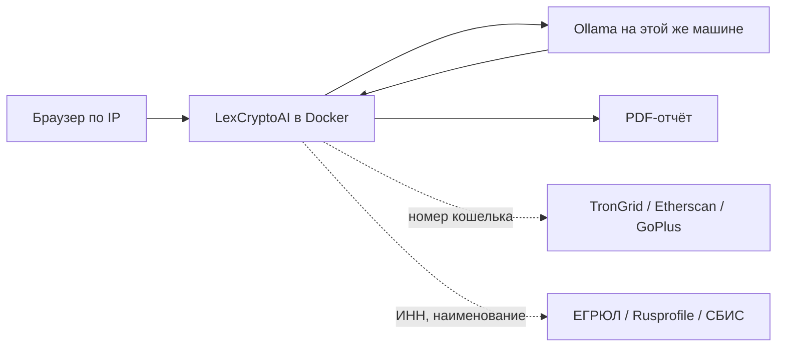

# LexCryptoAI — CryptoCompliance AI Agent

[](https://github.com/NikitaMok/LexCryptoAI/actions/workflows/ci.yml)
[](https://www.python.org/downloads/)

С 1 сентября 2026 года вступает в силу Федеральный закон от 04.08.2026 № 282-ФЗ
«О цифровых валютах и цифровых правах». Расчёты цифровой валютой внутри России
запрещены (ст. 1 ч. 6). Исключение — **внешнеторговые договоры между резидентами
и нерезидентами** (ст. 1 ч. 7 п. 1). Вместе с № 283-ФЗ это выводит на такие
контракты требования 115-ФЗ и 173-ФЗ: обязательный контроль от 10 млн рублей,
travel rule, постановка на учёт в банке, отчётность по операциям.

**LexCryptoAI** ставится на компьютер юриста или компании и проверяет
внешнеторговый договор с оплатой в цифровой валюте. Файл открывается в браузере
на этой же машине (или по IP в локальной сети). Текст договора **в интернет
не уходит**. Его читает программа на этой машине: матрица правил ставит вердикт;
если отвечает локальная Ollama, она выписывает смысл оговорок, которые
регулярками не ловятся, без ссылок на статьи и без цвета статуса. Номер
кошелька, ИНН и наименование извлекаются из текста программой. Уже эти
идентификаторы — не сам договор — запрашиваются во внешних источниках:
публичные данные блокчейна по адресу и открытые реестры по юрлицу. На выходе
PDF с тремя блоками: договор, кошелёк, контрагент.

Отчёт предварительный. Его нужно перечитать глазами, прежде чем что-либо
менять в договоре. Нести PDF в банк, налоговую или контрагенту как доказательство
«система сказала, что всё в порядке» нельзя: LexCryptoAI не выдаёт юридическое
заключение и не заменяет экспертизу.

---

## Ограничения использования

LexCryptoAI — предварительная автоматизированная проверка, не консультация
и не заключение для банка.

- Цветовой статус и формулировки в PDF не подтверждают соответствие договора
  закону и не гарантируют постановку контракта на учёт.
- Оценка кошелька по открытым данным **не** цифровой анализ по статье 35
  № 282-ФЗ.
- Сведения из ЕГРЮЛ — состояние записи на момент запроса, не подтверждение
  правоспособности на дату расчёта.
- Часть 2 статьи 30 № 282-ФЗ: сервис не сообщает способов обойти требование
  закона.

Полный текст: [`docs/LEGAL_DISCLAIMER.md`](docs/LEGAL_DISCLAIMER.md).

---

## Как проходит проверка

1. На рабочей машине поднимается Docker Compose (приложение) и Ollama
   с тяжёлой моделью. В браузере открывается `http://127.0.0.1:8000`
   либо `http://<IP-машины>:8000` с другого компьютера в той же сети.
2. Юрист загружает PDF или DOCX. Файл пишется во временный каталог
   на этой машине и после отчёта удаляется. Содержимое договора в журнал
   не попадает и на внешние LLM-сервисы не отправляется.
3. Программа проверяет договор по матрице правил на № 282-ФЗ, № 283-ФЗ,
   115-ФЗ, 173-ФЗ и Инструкцию Банка России № 181-И: квалификация
   внешнеторговой сделки, актив и сеть, адрес-идентификатор, курс,
   реквизиты сторон, пороговые оговорки. Локальная модель, если отвечает,
   выписывает смысл оговорок (агент, депег, дробление и т. п.) без вердикта.
4. Параллельно из того же текста программа извлекает номер кошелька
   (TRON / EVM) и данные контрагента. Для скоринга адреса сервис обращается
   к публичным RPC (TronGrid, Etherscan). Для сверки юрлица — к открытым
   реестрам по ИНН и наименованию. В сеть уходят номер адреса, ИНН и имя
   стороны, не файл договора.
5. Собирается PDF: замечания по тексту со ссылками на статьи, части и пункты;
   оценка кошелька; результат сверки контрагента. На первой странице —
   оговорка, что отчёт предварительный и подлежит ручной перепроверке.

---

## Два режима: бесплатный и свои сервисы

После `git clone` ничего покупать не нужно: модель, проверка контрагента
и скоринг кошелька уже прописаны. Это бесплатный режим, он включён
по умолчанию. «Платный» здесь не подписка LexCryptoAI, а ваши уже купленные
API (Chainalysis, Контур.Фокус и т. п.) — их подключают правкой двух файлов.

### Бесплатный (по умолчанию)

Ничего включать не нужно. Каталог — [`config/providers.yaml`](config/providers.yaml).

**Модель.** Уже выбрана `llama3.3:70b` в Ollama. Её один раз скачивают:
`ollama pull llama3.3:70b`. Это модель класса 70B; более мелкие в этот слот
не подставлять — см. раздел про машину.

**Контрагент.** Из договора берутся наименование и ИНН. Сверка идёт по открытым
карточкам: ЕГРЮЛ ФНС (`egrul.nalog.gov.ru`), [Rusprofile](https://www.rusprofile.ru/),
[СБИС](https://saby.ru/). Ключ не спрашивается. Объём данных — то, что площадка
отдаёт без договора: статус записи, ликвидация, совпадение названия. Это не
Контур.Фокус и не СПАРК.

**Кошелёк.** Из договора берётся адрес. Без ключа проверяются возраст
(не «вчера заведён»), активность, баланс USDT, публичные метки риска
(фишинг, известные инциденты) через TronGrid, Etherscan и GoPlus Labs.
Для сети Ethereum у Etherscan бесплатный ключ с их сайта — поле
`ETHERSCAN_API_KEY` в `.env`; TRON работает и без него. Это не Chainalysis
и не заключение по статье 35 № 282-ФЗ.

Текст договора по-прежнему никуда не уходит. В интернет уходят номер адреса,
ИНН и имя стороны.

### Свои сервисы и своя модель

Менять нужно только перечисленное. Ключи — в `.env`, не в yaml и не в git.

| Задача | Файл | Что сделать |
|--------|------|-------------|
| Сменить модель Ollama | `.env` | `OLLAMA_MODEL=<имя из ollama list>`. Строка перекрывает `llm.model` в yaml. Затем `ollama pull <имя>` |
| Другой адрес Ollama | `.env` | `OLLAMA_BASE_URL=http://127.0.0.1:11434` или IP GPU-хоста |
| Включить Chainalysis / Elliptic / BitOK | `config/providers.yaml` и `.env` | У записи (`chainalysis`, `elliptic`, `bitok`) поставить `enabled: true`. Ключ — `CHAINALYSIS_API_KEY`, `ELLIPTIC_API_KEY` или `BITOK_API_KEY` в `.env` |
| Включить Контур.Фокус / СПАРК / API СБИС | `config/providers.yaml` и `.env` | `enabled: true` у `kontur_focus`, `spark` или `sbis_api`. Ключи: `KONTUR_FOCUS_KEY`, `SPARK_API_KEY`, `SBIS_API_KEY` |
| Выключить бесплатный источник | `config/providers.yaml` | `enabled: false` у `egrul`, `rusprofile`, `saby`, `trongrid`, `etherscan` или `goplus` |
| Добавить сервис, которого нет в списке | код + yaml | Кошелёк — функция в [`app/aml/providers.py`](app/aml/providers.py). Контрагент — [`app/counterparty/providers.py`](app/counterparty/providers.py). В yaml — новая запись с `id`, `enabled: true`, `tier: paid`, `env_key`, `module` |

Образец `.env` со всеми именами ключей: [`.env.example`](.env.example).
После копирования `copy .env.example .env` секреты в репозиторий не попадают.

---

## Машина, на которой это можно запускать

Разбор договора — не краткое изложение текста. Модель держит в контексте
весь контракт с приложениями, отличает квалификацию внешнеторговой сделки
от упоминания слова «резидент», адрес-идентификатор цифрового депозитария —
от сырого `T…` / `0x…`, полный набор реквизитов travel rule — от частично
заполненной шапки, и не должна выдумывать номер статьи. Ошибка попадает
в PDF, который будут читать как рабочий черновик.

Легковесные модели (класс 7–8 млрд параметров) для этой задачи не годятся:
теряют пункты, ломают структуру ответа, принимают совпадение слова за
выполнение требования. Средние instruct-модели (примерно 13–32 млрд)
увереннее собирают ответ, но на договоре в десятки страниц по-прежнему
пропускают приложения и подставляют правдоподобные, но неверные ссылки
на нормы. Ставить их «чтобы хоть как-то завелось» нельзя: отчёт будет
выглядеть готовым и при этом быть неверным.

Нужна модель класса **70 млрд параметров** в Ollama (ориентир — `llama3.3:70b`
или сопоставимая reasoning-модель) в квантовании не грубее Q4. Отсюда
требования к компьютеру — это не офисный ноутбук и не VPS на несколько
гигабайт памяти.

| Ресурс | Минимум |
|--------|---------|
| Видеокарта | NVIDIA с **48 ГБ** видеопамяти (RTX 6000 Ada, A6000 48 ГБ, A100 80 ГБ) либо **две** карты по 24 ГБ (две RTX 4090) с разделением модели |
| Оперативная память | **64 ГБ** |
| Свободное место на диске | **100 ГБ** (веса модели 40–50 ГБ плюс образы Docker) |
| Процессор | 8 ядер |
| Система | Windows 10/11 с Docker Desktop и WSL2 либо Linux; драйвер NVIDIA |

На машине без дискретной видеокарты такого класса Ollama формально запустится
на процессоре и будет считать один договор часами с деградацией качества.
Так разворачивать сервис не следует. Docker упрощает установку приложения;
он не отменяет видеокарту.

---

## Нормативная база

| Акт | Роль |
|-----|------|
| № 282-ФЗ от 04.08.2026 «О цифровых валютах и цифровых правах» | Профильный закон |
| № 283-ФЗ от 04.08.2026 | Правки в 115-ФЗ, 173-ФЗ и ещё 19 актов |
| № 115-ФЗ | Противодействие легализации доходов |
| № 173-ФЗ | Валютное регулирование и валютный контроль |
| Инструкция Банка России № 181-И | Постановка контрактов на учёт |

Опорные нормы 282-ФЗ для ВЭД: ст. 1 ч. 7 п. 1 и ч. 8, ст. 18 ч. 5,
ст. 21 ч. 8 п. 1, ст. 30 ч. 1 п. 2 и ч. 7, ст. 31 ч. 4, ч. 5 п. 6 и ч. 8 п. 1.
Учёт на адресах-идентификаторах — ст. 17, 22–24. Цифровой анализ — ст. 35.

Пороги: от 10 млн рублей — обязательный контроль (115-ФЗ, ст. 6 п. 1.12);
свыше 60 000 рублей — передача реквизитов сторон (115-ФЗ, ст. 7.2-1);
от 3 млн рублей по импортному контракту — постановка на учёт в банке
(Инструкция № 181-И, п. 4.3; для экспорта тот же пункт — 10 млн рублей).

---

## Архитектура



Текст договора остаётся в Docker и в Ollama. Исходящие запросы в интернет —
только идентификаторы, нужные для скоринга адреса и сверки юрлица.

Матрица из 32 правил и корпус норм работают рядом с моделью: ссылка
«ст. 1 ч. 7 п. 1» разрешается в дословный текст нормы, а не в пересказ.
Подробнее: [`docs/ARCHITECTURE.md`](docs/ARCHITECTURE.md),
[`docs/RULES_SPEC.md`](docs/RULES_SPEC.md).

---

## Развёртывание

Нужны Docker и Ollama на машине, которая проходит таблицу выше.

```bash
git clone https://github.com/NikitaMok/LexCryptoAI.git
cd LexCryptoAI
copy .env.example .env         # Linux/Mac: cp .env.example .env
```

Ollama ставится с [ollama.com](https://ollama.com/). На Windows так проще
пробросить видеокарту, чем через NVIDIA Container Toolkit внутри Compose.
Модель один раз скачивается (десятки гигабайт):

```bash
ollama pull llama3.3:70b
```

Приложение:

```bash
docker compose up --build
```

Страница: `http://127.0.0.1:8000`. С другого компьютера в той же сети —
`http://<IP-этой-машины>:8000` (порт 8000 не должен быть закрыт локальным
брандмауэром). Compose пробрасывает Ollama на хосте
(`OLLAMA_BASE_URL=http://host.docker.internal:11434`). Если модель не
ответила, договор всё равно проверяется по матрице правил; в отчёте это сказано.

Для разработки без Docker:

```bash
py -3.11 -m venv venv
venv\Scripts\activate
pip install -r requirements.txt -r requirements-dev.txt
copy .env.example .env
uvicorn app.api.main:app --reload
```

---

## Статус

Работает разбор PDF/DOCX, матрица правил, локальная Ollama на смысле оговорок
(вердикт по-прежнему у предикатов), скоринг кошелька и сверка контрагента
в одном прогоне, страница и PDF из трёх блоков. Если Ollama не запущена,
проверка по матрице всё равно выполняется; в отчёте написано, что модель
не ответила. Если ЕГРЮЛ или GoPlus не ответили — «сверка не выполнена»
или «нет данных», не «всё в порядке». Платные записи в
[`config/providers.yaml`](config/providers.yaml) при `enabled: true` без
готового коннектора дают ту же формулировку, а не фиктивный успех.

```bash
python -m scripts.check_contract договор.docx --on 2026-09-01
python -m scripts.check_contract договор.docx --on 2026-09-01 --pdf заключение.pdf
curl -F file=@договор.docx "http://127.0.0.1:8000/check?on=2026-09-01"
curl -F file=@договор.docx "http://127.0.0.1:8000/check/pdf?on=2026-09-01" -o заключение.pdf
```

Автоматизировано 30 правил из 32, из 17 обязательных — 16. Образцовый
контракт даёт зелёный статус, нарушающий — красный. Норма без выверенного
текста помечается как невыверенная, а не пересказывается.

---

© Никита Мокин / Nikita Mokin
[GitHub](https://github.com/NikitaMok)

Все права защищены.
Копирование репозитория, воспроизведение существенных частей решения и
использование кода либо продукта в коммерческих целях без предварительного
письменного согласия правообладателя запрещены.
Размещение исходников на GitHub предназначено для демонстрации компетенций и
не предоставляет лицензии на их коммерческую эксплуатацию.
