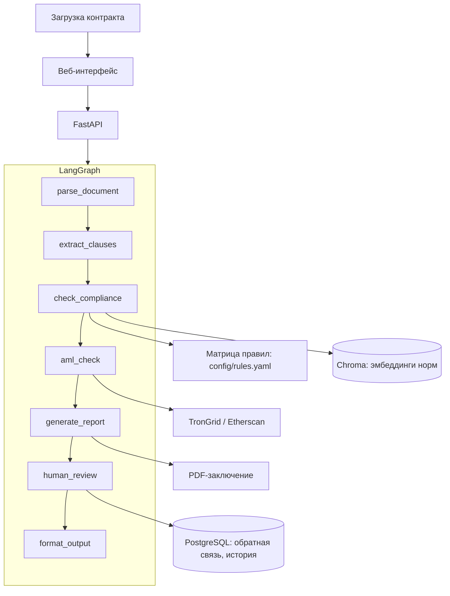

# LexCryptoAI — CryptoCompliance AI Agent

[](https://github.com/NikitaMok/LexCryptoAI/actions/workflows/ci.yml)
[](https://www.python.org/downloads/)

С 1 сентября 2026 года вступает в силу Федеральный закон от 04.08.2026 № 282-ФЗ
«О цифровых валютах и цифровых правах». Расчёты цифровой валютой в России
запрещены (ст. 1 ч. 6), и единственное существенное исключение — **внешнеторговые
договоры между резидентами и нерезидентами** (ст. 1 ч. 7 п. 1).

Это исключение открывает импортёрам легальный путь платить за товар в USDT,
но цена ошибки высока: неверная формулировка в контракте ведёт к отказу банка
в постановке на учёт, блокировке счёта по 115-ФЗ и штрафам. Юридическая
консультация по одному договору стоит 50–100 тыс. рублей, типовых решений
на рынке нет.

**LexCryptoAI** разбирает внешнеторговый контракт с расчётами в цифровой валюте,
проверяет обязательные оговорки по матрице правил, оценивает риск кошелька
контрагента по открытым данным блокчейна и выдаёт заключение со ссылками
на конкретные части и пункты статей — в виде PDF, готового для банка и налоговой.

Автор — практикующий юрист: прокуратура, суд, договорная работа и ВЭД
в крупных компаниях. Матрицу правил наполняет он же, исходя из того, какие
формулировки банки принимают, а какие возвращают на доработку.

---

## Ограничения использования

LexCryptoAI — инструмент предварительной проверки, а не юридическая консультация.
Заключение сервиса не заменяет правовую экспертизу, не гарантирует принятие
контракта банком и не освобождает от самостоятельной проверки актуальности норм
на момент сделки.

Проверка кошелька контрагента — предварительная информационная проверка
по открытым данным. Это **не** цифровой анализ в смысле статьи 35 № 282-ФЗ:
такая обязанность возложена законом на лиц, организующих обращение цифровых
валют, клиринговые организации и операторов, а её выполнение требует включения
в реестр поставщиков услуг цифрового анализа.

Подробнее: [`docs/LEGAL_DISCLAIMER.md`](docs/LEGAL_DISCLAIMER.md).

---

## Как это работает

1. **Разбор документа** — PDF/DOCX приводится к структурированному виду.
2. **Извлечение оговорок** — квалификация договора как внешнеторгового,
   идентификация актива, адрес-идентификатор, фиксация курса, AML-дисклеймер.
3. **Проверка по матрице правил** — каждая оговорка сопоставляется с нормой;
   обязательные дают красный статус, рекомендательные — жёлтый.
4. **Проверка кошелька** — скоринг по возрасту, активности, балансу и составу
   токенов на основе публичных RPC.
5. **Заключение** — цветовой статус, пояснение по каждому пункту, ссылки на нормы,
   PDF-отчёт.

Контракт не сохраняется: файл живёт во временной папке и удаляется сразу после
генерации отчёта.

---

## Нормативная база

| Акт | Роль |
|-----|------|
| № 282-ФЗ от 04.08.2026 «О цифровых валютах и цифровых правах» | Профильный закон, ядро матрицы правил |
| № 283-ФЗ от 04.08.2026 | Правит 21 акт, в том числе 115-ФЗ (ст. 7) и 173-ФЗ о валютном регулировании (ст. 12) |
| № 115-ФЗ | Противодействие легализации доходов |
| № 173-ФЗ | Валютное регулирование и валютный контроль |
| Инструкция Банка России № 181-И | Постановка контрактов на учёт |

Опорные нормы 282-ФЗ для ВЭД: ст. 1 ч. 7 п. 1 и ч. 8, ст. 18 ч. 5,
ст. 21 ч. 8 п. 1, ст. 30 ч. 1 п. 2 и ч. 7, ст. 31 ч. 4, ч. 5 п. 6 и ч. 8 п. 1.
Учёт на адресах-идентификаторах — ст. 17, 22–24. Цифровой анализ — ст. 35.

Пороговые нормы: операция по внешнеторговому договору на сумму от 10 млн рублей
подлежит обязательному контролю (115-ФЗ, ст. 6 п. 1.12); при сумме свыше
60 000 рублей действует требование о передаче реквизитов сторон (115-ФЗ,
ст. 7.2-1); контракт от 3 млн рублей ставится на учёт в банке (Инструкция № 181-И).

---

## Архитектура



Всё разворачивается на одном VPS через Docker Compose: без облачных баз данных,
без Kubernetes, без платных API.

Подробнее: [`docs/ARCHITECTURE.md`](docs/ARCHITECTURE.md).

---

## Технологический стек

| Слой | Состав |
|------|--------|
| Язык | Python 3.11 |
| Backend | FastAPI |
| Оркестрация | LangGraph |
| Vector DB | Chroma |
| LLM | GigaChat / YandexGPT |
| Данные | PostgreSQL, SQLAlchemy, Alembic |
| Отчёты | ReportLab |
| Frontend | Next.js (статическая сборка) |
| Observability | Prometheus, Grafana, Sentry |
| Инфраструктура | Docker Compose, GitHub Actions, VPS |

---

## Локальный запуск

```
LexCryptoAI/
  app/           # agent, api, rules, parsing, aml, report, llm, vectorstore
  config/        # матрица правил, справочники
  data/          # curated в git; raw/processed — локально
  docs/
  scripts/
  tests/
```

```bash
py -3.11 -m venv venv
venv\Scripts\activate          # Linux/Mac: source venv/bin/activate
pip install -r requirements.txt -r requirements-dev.txt
copy .env.example .env         # Linux/Mac: cp .env.example .env
```

```bash
uvicorn app.api.main:app --reload
pytest
```

---

## Статус

Ранняя стадия. Готово: матрица правил проверки контракта — 32 правила
в восьми группах, из них 17 обязательных ([`docs/RULES_SPEC.md`](docs/RULES_SPEC.md));
разбор PDF и DOCX с приведением текста к нумерованным пунктам; извлечение
из договора адресов, тикеров, сетей, сумм, ИНН и маркеров квалификации сделки.

В работе: движок проверки по матрице, поиск норм по эмбеддингам, скоринг адреса
контрагента, веб-интерфейс и генерация заключения.

---

© Никита Мокин / Nikita Mokin
[GitHub](https://github.com/NikitaMok) ·
[LinkedIn](https://ru.linkedin.com/in/mokinnikita)

Все права защищены.
Копирование репозитория, воспроизведение существенных частей решения и
использование кода либо продукта в коммерческих целях без предварительного
письменного согласия правообладателя запрещены.
Размещение исходников на GitHub предназначено для демонстрации компетенций и
не предоставляет лицензии на их коммерческую эксплуатацию.
