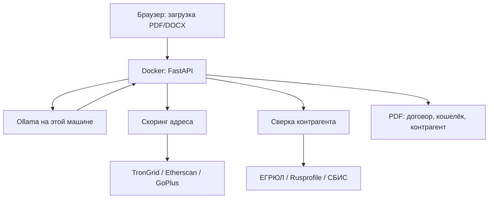

# Архитектура

Документ описывает, как сервис должен работать у юриста на своей машине.
Что уже сделано — в разделе «Статус реализации».

---

## 1. Принципы

1. **Договор не покидает машину.** Файл загружается в браузере по адресу
   этой установки (`127.0.0.1` или IP в локальной сети). Текст читает
   локальная Ollama. На внешние LLM-сервисы он не отправляется.
2. **В интернет уходят только идентификаторы.** Номер кошелька — на публичные
   RPC. ИНН и наименование контрагента — в открытые реестры. Сам файл
   и полный текст договора в эти запросы не входят.
3. **Три блока в одном PDF.** Замечания по договору, скоринг кошелька,
   сверка контрагента. Это предварительный отчёт: его нельзя нести в банк
   как подтверждение соответствия.
4. **Файл не хранится.** Временный каталог, удаление сразу после PDF.
5. **Ссылка на норму — дословная.** «Ст. 1 ч. 7 п. 1» разрешается в текст
   из корпуса, а не пересказывается моделью.
6. **Тяжёлая модель на этой же машине.** Класс 70B, видеокарта порядка 48 ГБ.
   Офисный компьютер и VPS на несколько гигабайт для разбора договора
   не используются.

---

## 2. Поток



| Шаг | Что происходит | Где в коде |
|-----|----------------|------------|
| Приём файла | Браузер → `POST /check` / `/check/pdf`. Файл во временный каталог | `app/api/main.py`, `uploads.py` |
| Разбор | PDF/DOCX → текст и нумерованные пункты | `app/parsing` |
| Смысл оговорок | Локальная Ollama, JSON; вердикт не ставит | `app/llm` |
| Договор | Матрица из 32 правил | `app/rules` |
| Кошелёк | Из текста — адрес; вовне — возраст, активность, USDT, метки GoPlus | `app/aml` |
| Контрагент | Из текста — ИНН и имя; вовне — ЕГРЮЛ / Rusprofile / СБИС | `app/counterparty` |
| PDF | Три блока и оговорка о ручной перепроверке | `app/report/pdf.py` |

Оркестрация — FastAPI. LangGraph в прогоне не участвует и в зависимости
не входит.

---

## 3. Модель и железо

Разбор договора требует держать в контексте полный текст и отличить
юридическую конструкцию от совпадения слов. Модели на 7–8 млрд параметров
этого не делают. Средние instruct на 13–32 млрд дают связный, но ненадёжный
ответ: пропускают приложения, путают сырой адрес с адресом-идентификатором
депозитария, выдумывают пункт статьи.

Рабочий минимум: Ollama, модель класса 70B (`llama3.3:70b` или сопоставимая),
квантование не грубее Q4. Видеокарта NVIDIA с 48 ГБ (или две по 24 ГБ),
64 ГБ оперативной памяти, 100 ГБ на диске. Docker поднимает приложение;
Ollama на Windows ставится отдельно — так проще отдать видеокарту, чем
через NVIDIA Container Toolkit внутри Compose.

---

## 4. Матрица правил

Состав — [`RULES_SPEC.md`](RULES_SPEC.md), зеркало — `config/rules.yaml`.
Правила живут в git, а не в PostgreSQL: меняются вместе с кодом и покрыты
тестами.

Поле `effective_from` обязательно: 282-ФЗ вступает в силу поэтапно (ст. 56).
На 01.09.2026 отложены `ADR-005` (с 01.07.2027) и `RPT-003` (репатриация
пока не введена).

Правило нулевого уровня: договор должен быть внешнеторговым между резидентом
и нерезидентом (ст. 1 ч. 7 п. 1 № 282-ФЗ). Иначе расчёты под общим запретом
ч. 6 той же статьи.

---

## 5. Нормативный корпус

Ссылка правила ищется в `data/curated/norms.jsonl` без модели. Нет выверенного
текста — в отчёте «текст не выверен», не пересказ. Сборка: `scripts/build_norms.py`.
Объявленный пробел корпуса: п. 2 ст. 7 № 115-ФЗ (тело о необычных
операциях не выверено). В корпус внесены подп. 8–11 п. 1 ст. 6, п. 5.2-1,
п. 5.2-2 и п. 16 ст. 7 № 115-ФЗ — по тексту 283-ФЗ. Пункты 4.2, 4.3 и 5.1
Инструкции № 181-И внесены по Указанию № 6819-У.

Поиск по формулировке (когда ссылки нет): BM25 с отсечением окончаний.
Эмбеддинги — по флагу `DENSE_SEARCH` / `--dense`.

---

## 6. Развёртывание

```
браузер  ──►  :8000  FastAPI (Docker)
                ├──►  Ollama на хосте (:11434), текст договора
                ├──►  TronGrid / Etherscan — только номер адреса
                └──►  ЕГРЮЛ — только ИНН и наименование
```

`docker compose up --build` поднимает API. Ollama — отдельный процесс
на той же машине. Страница доступна по `127.0.0.1` и по IP машины в LAN.

---

## 7. Статус реализации

| Компонент | Статус |
|-----------|--------|
| Матрица правил, парсер PDF/DOCX, движок | Готово |
| Корпус норм, BM25, эмбеддинги по флагу | Готово |
| HTTP, страница, PDF из трёх блоков | Готово |
| Локальная Ollama на смысле оговорок | Вызывается; если молчит — прогон идёт дальше |
| Скоринг адреса в том же прогоне | Готово (TronGrid / Etherscan / GoPlus); не ст. 35 |
| Сверка контрагента по ИНН | Готово (ЕГРЮЛ / Rusprofile / СБИС); нет ответа — «сверка не выполнена» |
| Платные слоты yaml | Включил — в отчёте честно «коннектор не реализован», пока нет HTTP-клиента |
| Docker Compose | API на 8000, Ollama на хосте через host.docker.internal |
| Дата проверки без `--on` / `?on=` | До 01.09.2026 — как на 01.09.2026, иначе сегодня |
| Повторный PDF по тому же файлу | Без второго вызова модели и реестров |

```bash
python -m scripts.check_contract договор.docx --on 2026-09-01 --pdf заключение.pdf
```
