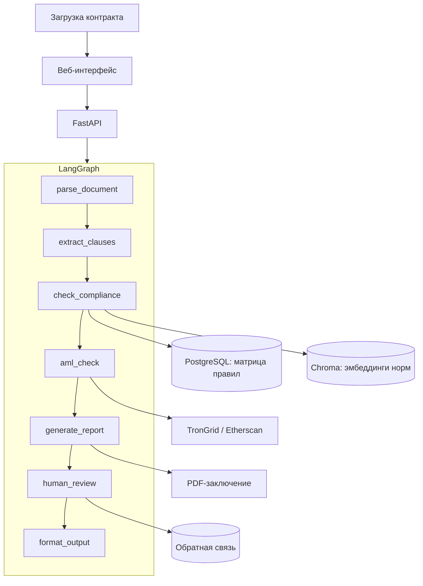

# Архитектура

Документ описывает целевую архитектуру. Реализованные части отмечены в разделе
«Статус реализации».

---

## 1. Принципы

1. **Один VPS, никаких управляемых сервисов.** 2 vCPU, 4 ГБ RAM, Docker Compose.
   Векторный индекс встраиваемый (Chroma), реляционная база — локальный PostgreSQL.
2. **Никаких платных внешних API.** Единственные внешние вызовы — публичные
   RPC-ноды блокчейна и российская LLM.
3. **Контракт не хранится.** Файл существует во временном каталоге ровно столько,
   сколько нужно для формирования отчёта.
4. **Детерминизм там, где возможно.** Обязательные требования проверяются
   правилами, а не рассуждением модели. LLM отвечает за извлечение смысла из
   текста и формулировку пояснений, но не за вывод «соответствует / не
   соответствует».
5. **Каждое утверждение в отчёте имеет ссылку на норму** с точностью до части
   и пункта статьи.

---

## 2. Поток обработки



### Узлы графа

| Узел | Задача | Пакет |
|------|--------|-------|
| `parse_document` | PDF/DOCX → нормализованный текст с разбивкой на нумерованные пункты | `app/parsing/document.py`, `structure.py` |
| `extract_clauses` | Детерминированные факты регулярными выражениями, затем семантические оговорки через LLM | `app/parsing/extract.py` |
| `check_compliance` | Прогон по матрице правил, RAG-подсказка при нечёткой формулировке | `app/rules` |
| `aml_check` | Скоринг кошелька контрагента по открытым данным | `app/aml` |
| `generate_report` | Сборка заключения: статус, пояснения, ссылки на нормы | `app/report` |
| `human_review` | Маршрутизация на юриста при низкой уверенности | `app/agent` |
| `format_output` | JSON для интерфейса и PDF для банка | `app/report` |

---

## 3. Матрица правил

Ядро продукта. Наполняется юристом, версионируется, состав описан
в [`RULES_SPEC.md`](RULES_SPEC.md), машиночитаемое зеркало — `config/rules.yaml`,
модель и загрузчик — `app/rules/registry.py`.

Источником истины на этапе проектирования выбран YAML в репозитории, а не
PostgreSQL: правила меняются вместе с кодом, проходят ревью в pull request
и покрываются тестами. Перенос в базу имеет смысл тогда, когда правила начнут
редактироваться через интерфейс, а не через коммит.

Расхождение между спецификацией и конфигом отлавливается тестом
`tests/test_rules_config.py`: он сверяет состав кодов и подсчёты в сводной
таблице спецификации с фактическим содержимым YAML.

Поле `effective_from` обязательно: закон № 282-ФЗ вступает в силу поэтапно
(статья 56), а нормативные акты Банка России будут приниматься уже после запуска
сервиса. Значение `null` означает, что норма ещё не введена в действие: правило
хранится неактивным и активируется при появлении подзаконного акта. На дату
01.09.2026 отложены `ADR-005` (с 01.07.2027) и `RPT-003` (требование
о репатриации не установлено).

### Правило нулевого уровня

Прежде чем проверять оговорки, система обязана убедиться, что договор
квалифицируется как **внешнеторговый договор между резидентом и нерезидентом**
(ст. 1 ч. 7 п. 1 № 282-ФЗ). Без этого расчёты цифровой валютой подпадают под
общий запрет части 6 той же статьи, и остальные проверки теряют смысл.

---

## 4. Нормативный корпус

Два слоя, и порядок между ними важен.

**Точное разрешение ссылки.** Ссылка правила вида «ст. 1 ч. 7 п. 1» разбирается
на структуру и ищется в корпусе `data/curated/norms.jsonl` — это обычный
детерминированный поиск, без эмбеддингов и без модели. Именно так текст нормы
попадает в заключение: дословно, а не пересказом.

Корпус собирается скриптом `scripts/build_norms.py`. Тексты № 282-ФЗ
разбираются автоматически из выгрузки закона по заголовкам глав и статей
и нумерации частей и пунктов. Нормы № 115-ФЗ и № 173-ФЗ этот закон правит,
а не излагает целиком, поэтому они выверены вручную по тексту № 283-ФЗ
и лежат в `config/norms_amendments.yaml` с указанием, каким пунктом какая
формулировка внесена.

Корпус коммитится: тесты и заключение работают с ним, а исходные выгрузки
законов остаются локальными.

Тест `tests/test_norms.py` проверяет, что каждая ссылка матрицы разрешается
в реальный текст. Норма, текст которой не выверен, обязана быть объявлена
пробелом с объяснением: в заключении вместо неё выводится «текст не выверен»,
а не пересказ по памяти. Список объявленных пробелов может только сокращаться —
новая запись в нём означает осознанное решение, а не забытую сверку.

**Поиск нормы по формулировке.** Нужен там, где ссылки нет: формулировка
в договоре нечёткая, и надо предложить, к какой норме её подтянуть.

Реализован лексический поиск BM25 с отсечением окончаний
(`app/norms/search.py`). Он не требует моделей и работает всюду, где работает
сервис. Отсечение окончаний обязательно: без него «депозитарию» в запросе
не находит «депозитарий» в норме.

Поиск по эмбеддингам подключается тем же интерфейсом и уточняет результат там,
где формулировки расходятся лексически. Разрыв виден на запросе «возврат валюты
в Россию»: лексический слой не связывает его с репатриацией, потому что общих
слов нет. Этот случай зафиксирован тестом как известное ограничение — слои
дополняют друг друга, а не заменяют.

Утверждение попадает в отчёт только при наличии опоры на текст нормы — подход,
отработанный в [RegioBuild](https://github.com/NikitaMok/RegioBuild).

---

## 5. Оценка качества

| Метрика | Что измеряет |
|---------|--------------|
| Compliance Score | Доля покрытых обязательных требований |
| Citation Accuracy | Правильность ссылок на нормы |
| Hallucination Rate | Доля утверждений без опоры на источник |

Регрессионное тестирование на размеченном наборе контрактов, судья — LLM
с ручной валидацией выборки.

---

## 6. Развёртывание

```
nginx  ──►  статика фронтенда
       └──► /api ──► backend (FastAPI + Chroma + парсеры)
                          └──► postgres
```

Один `docker-compose.yml`, TLS через Let's Encrypt, метрики в Prometheus,
ошибки в Sentry, выкладка через GitHub Actions.

---

## 7. Статус реализации

| Компонент | Статус |
|-----------|--------|
| Каркас репозитория, конфигурация, CI | Готово |
| Матрица правил: спецификация, конфиг, загрузчик | Готово — 32 правила, `docs/RULES_SPEC.md` |
| Парсер документов: PDF, DOCX, нормализация | Готово — `app/parsing/document.py` |
| Разбор на нумерованные пункты | Готово — `app/parsing/structure.py` |
| Детерминированное извлечение фактов | Готово — `app/parsing/extract.py` |
| Движок проверки по матрице | Готово — `app/rules/engine.py`, 22 правила из 32 |
| Проверка из командной строки | Готово — `scripts/check_contract.py` |
| Разбор закона на нормы | Готово — `app/ingestion/laws.py` |
| Точное разрешение ссылок в текст нормы | Готово — `app/norms/index.py`, 264 нормы |
| Запрет на выдачу способов обхода закона | Готово — `app/rules/guardrail.py` |
| Лексический поиск нормы по формулировке | Готово — `app/norms/search.py`, BM25 |
| Поиск нормы по эмбеддингам | Код готов — `app/norms/dense.py`, по умолчанию выключен |
| HTTP-приём контракта | Готово — `POST /check`, `POST /check/pdf`, `GET /search` |
| PDF-заключение | Готово — `app/report/pdf.py` |
| Оценка адреса по открытым данным | Готово — `app/aml/`, не цифровой анализ ст. 35 |
| Перечень ФАТФ для AML-002 | Снимок заявления ФАТФ 19.06.2026, не перечень Правительства |
| Веб-интерфейс | Готово — статическая страница `app/web/static/` |
| Семантическое извлечение оговорок (LLM) | Не начато |
| HITL и eval | Частично: ручная оценка в отчёте, без очереди в PostgreSQL |
| Развёртывание | Каркас — `Dockerfile`, `docker-compose.yml` |

Сквозной проход «контракт на входе — перечень нарушений на выходе» работает
без LLM:

```bash
python -m scripts.check_contract договор.docx --on 2026-09-01
python -m scripts.check_contract договор.docx --on 2026-09-01 --pdf заключение.pdf
```

Ближайшая задача — постановка образа на VPS и семантическое извлечение оговорок
для правил, которые не сводятся к регулярным выражениям. Поиск по эмбеддингам
включается локально (`DENSE_SEARCH=true`), когда скачана мультиязычная модель.
